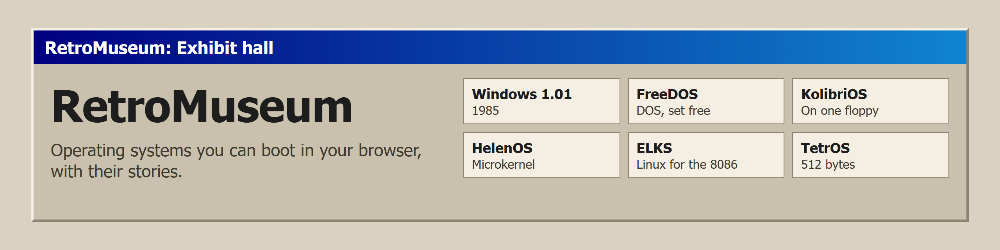
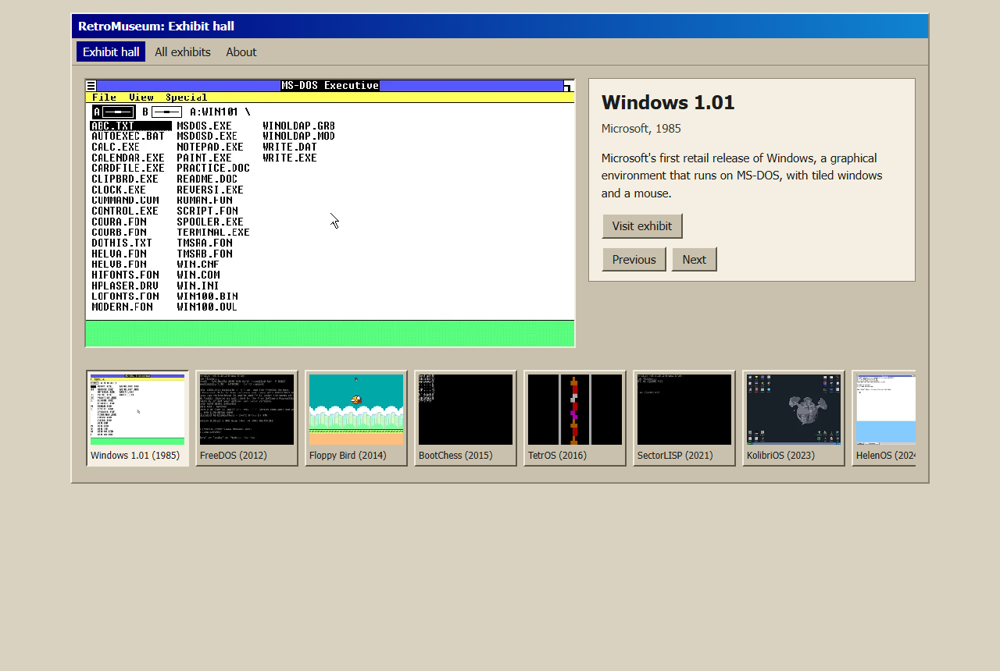
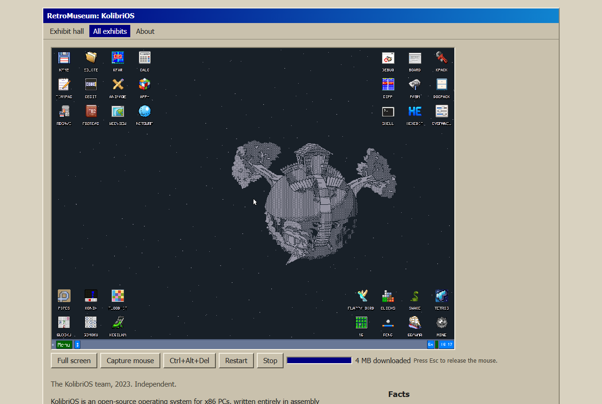

<p align="center"><a href="https://hammadshakeelai.github.io/RetroMuseum/"></a></p>

**Visit:** https://hammadshakeelai.github.io/RetroMuseum/

RetroMuseum is a museum of operating systems you can boot in your browser. Each exhibit is a real operating system running in the [v86](https://github.com/copy/v86) PC emulator, with its story, its facts, and things to try.

<p align="center"></p>
<p align="center"></p>

## Visiting

- **Exhibit hall:** one exhibit at a time, with **Previous** and **Next**, and every exhibit in a strip below, oldest first.
- **All exhibits:** every exhibit, filtered by family: DOS; Windows; Unix, BSD & Linux; Independent; Boot-sector.
- **An exhibit:** small open-source systems boot right on their page with **Boot it**, from disk images RetroMuseum hosts. The page says roughly how much they download. The others open on copy.sh, the v86 project's own site, with **Run it on copy.sh**.

Every exhibit started to a working screen in RetroMuseum's screenshot check before it was added.

## Copyrighted exhibits

Some exhibits are copyrighted software, shown for their history. They run on copy.sh, and RetroMuseum doesn't host or offer their disk images. If you hold rights to an exhibit and want it removed, [open a removal request](https://github.com/hammadshakeelai/RetroMuseum/issues/new?template=removal-request.yml).

## Development

Requires Node 22.12 or newer.

```bash
npm install
npm run images         # download the hosted disk images into public/images/
npm run dev            # http://localhost:4321/RetroMuseum/
npm test               # unit tests
npm run typecheck
npm run build && npm run test:e2e
```

### Adding an exhibit

1. Create `src/content/exhibits/<slug>.md` from the exhibit's profile in v86's [`src/browser/main.js`](https://github.com/copy/v86/blob/master/src/browser/main.js). An exhibit is one of two kinds:
   - **hosted**, for open-source systems with no snapshot and an image of at most 100 MB: a `diskImage` block (where to download it, its SHA-256, its license, and its source code) and a `v86` block with the image's file name;
   - **on copy.sh**, for everything else: `copyShProfile` set to the profile's id.

   See an existing exhibit for the other fields.
2. Write its story, facts, and things to try from the sources you list.
3. Run `npm run images`, then `npm run screenshots -- --only=<slug> --write`. It starts the exhibit, saves its screenshot, and records how much it downloads. Check the screenshot before committing.

A weekly workflow checks that hosted images still download from their origins and load on the site, and that copy.sh still has each profile. It opens an issue if something breaks.

## License

MIT. See [THIRD_PARTY_NOTICES.md](THIRD_PARTY_NOTICES.md) for v86, SeaBIOS, and the operating systems shown.
